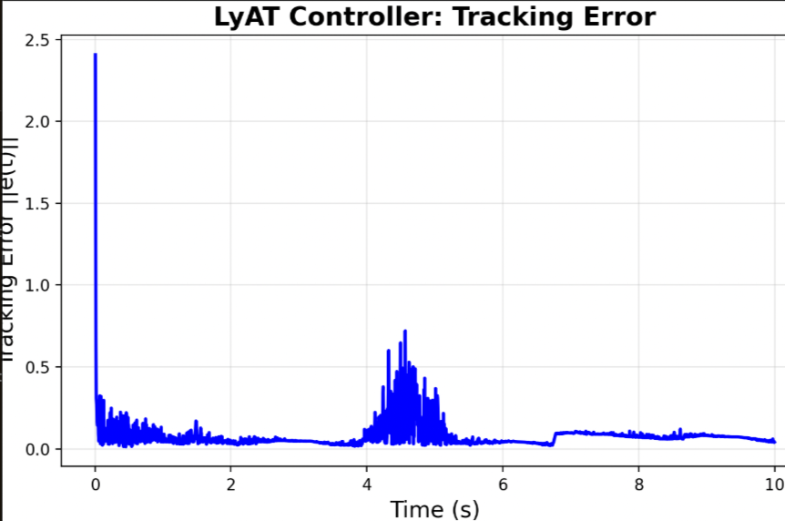

# Lyapunov Adaptive Transformer (LyAT) for Quadrotor Control

## Overview

Implements a Lyapunov-based adaptive controller for onbard autonomous quadrotor trajectory tracking under 
model uncertainties. 

---

### Frame Conventions
- **APark Frame**: Local park coordinates (rotated ENU, origin at field center)
- **UTM**: Universal Transverse Mercator for GPS conversion
- **ENU**: East-North-Up (MAVROS local frame)
- **NED**: North-East-Down (PX4 body frame)

---

## Prerequisites

### Required Software
- Ubuntu 22.04 + ROS2 Humble
- PX4-Autopilot 1.15 (https://github.com/PX4/PX4-Autopilot/releases/tag/v1.15.4)
- Mavros
- Gazebo Fortress (https://gazebosim.org/docs/fortress/install_ubuntu/)
- QGroundControl (https://docs.qgroundcontrol.com/master/en/qgc-user-guide/getting_started/download_and_install.html)
---

### Python dependencies
```bash
pip3 install torch numpy scipy geodesy transforms3d
```

### Required Packages
```bash
cd ~/ros2_ws/src
git clone https://github.com/UFL-Autonomy-Park/aero_common
git clone https://github.com/Jordan-Insinger/lyapunov_adaptive_transformer
cd aero_common
git submodule update --init --recursive
cd ~/ros2_ws
colcon build --packages-select px4_safety_lib autonomy_park_viz px4_telemetry px4_teleop lyapunov_adaptive_transformer
source install/setup.bash
```

## Usage

### Simulation (Gazebo)
```bash
# Open QGC

# Terminal 1: Launch PX4 SITL
cd ~/PX4-Autopilot
make px4_sitl gz_x500

# Terminal 2: Start MAVROS
ros2 launch px4_telemetry px4_sim.launch

# Terminal 3: Launch Telemetry Node
ros2 launch px4_telemetry astro_sim.launch.py

# Terminal 4: Launch Control Node
ros2 launch lyapunov_adaptive_transformer lyapunov_adaptive_transforerm.launch.py
```

### Configuration
```json
{
    "n_states": 6,
    "window_size": 20,
    "T_final": 120.0,
    "dt": 0.005,
    "ke": 100.0,
    "gamma": 2.0,
    "sigma": 0.00001,
    "theta_bar": 200.0,
    "num_encoder_layers": 2,
    "num_decoder_layers": 2,
    "num_heads": 6,
    "d_ff": 128,
    "gamma_encoder_attn": 1.0,
    "beta_encoder_attn": 0.0,
    "gamma_encoder_ff": 1.0,
    "beta_encoder_ff": 0.0,
    "gamma_decoder_self": 1.0,
    "beta_decoder_self": 0.0,
    "gamma_decoder_cross": 1.0,
    "beta_decoder_cross": 0.0,
    "gamma_decoder_ff": 1.0,
    "beta_decoder_ff": 0.0
}
```

---

## Results

Achieved --RESULTS HERE-- RMS tracking error on --TRAJECTORY HERE--


### Convergence Behavior



**Related Publications:**
- link_to_paper_when_published

---

## Acknowledgments

This work was developed at the Nonlinear Control and Robotics Lab, University of Florida. Special thanks to:
- Dr. Warren Dixon (Advisor)
- Saia Akbari (Wrote the paper)  

---
